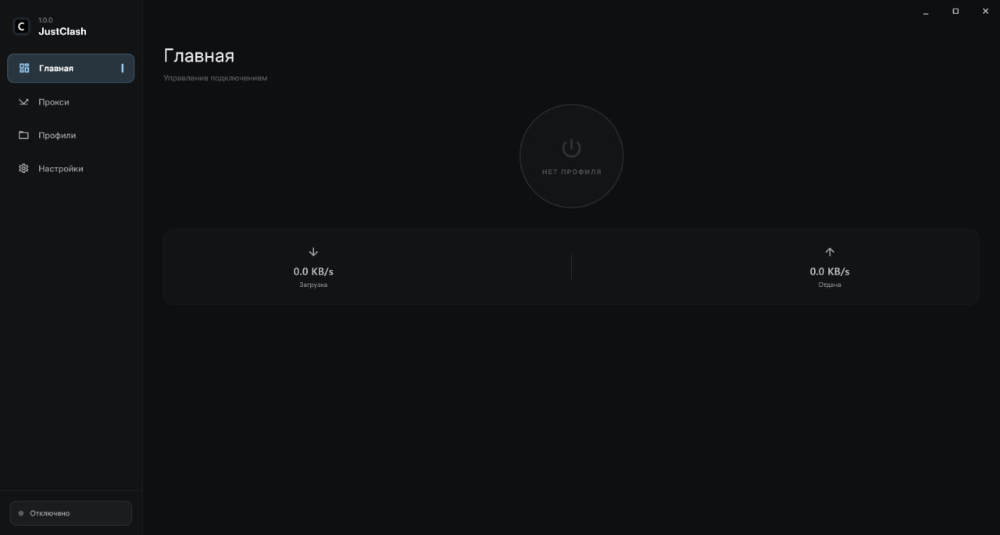
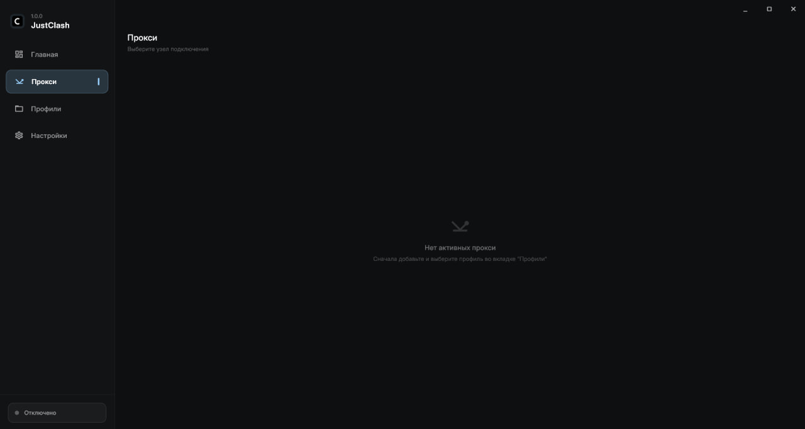
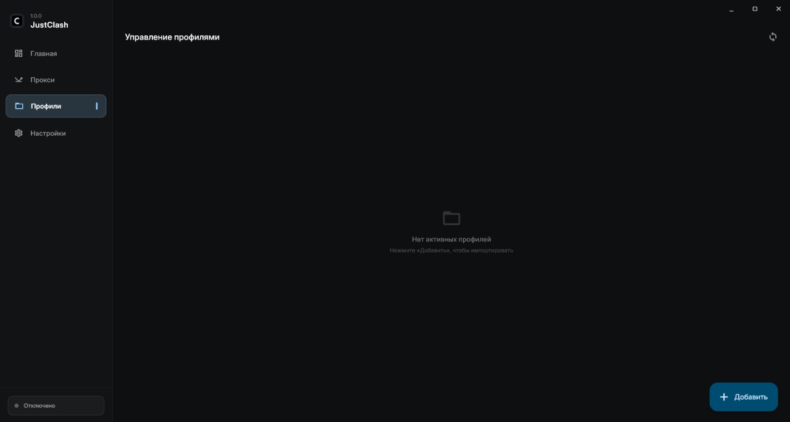
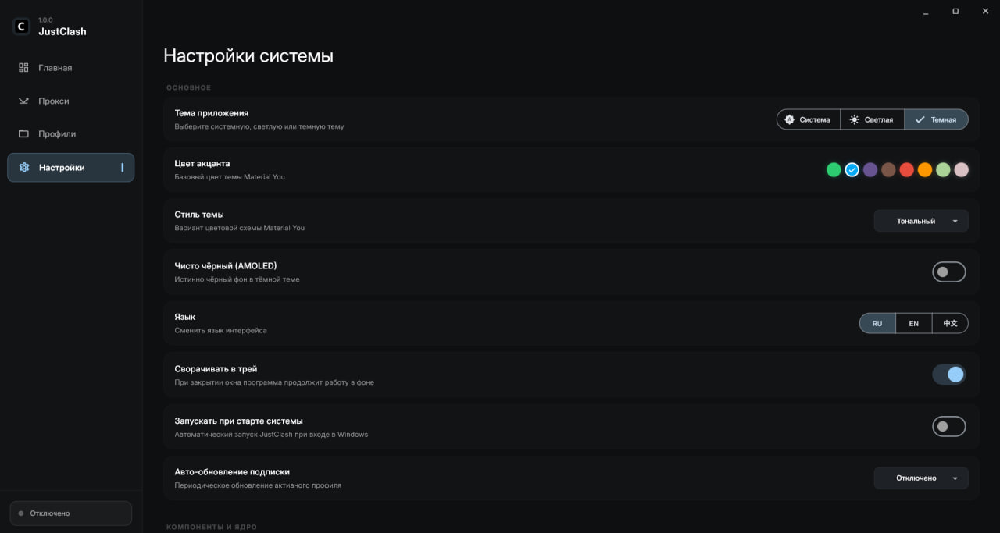

# JustClash

**Lightweight VLESS / proxy client for Windows & Android, optimized for low-end devices.**

[English](README.md) · [Русский](README.ru.md) · [中文](README.zh.md)

# Overview

JustClash is a simple, fast proxy client for Windows and Android. It runs on the **Mihomo (Clash.Meta)** core, bundled inside the app.

# Screenshots

  
  
  
  

# Features

- **System-wide traffic protection** — TUN mode on Windows, `VpnService` on Android
- **One-click subscription import** (VLESS and other protocols, Clash and raw configs) — paste a link, or scan a QR code on Android
- **Automatic subscription updates** — on launch and in the background
- **Server / location selector**, proxy groups, latency test, country flags
- **Rule mode and Direct mode**
- **Bundled geo databases** with auto-update
- **Themes**: light / dark / pure black (AMOLED) + accent color
- **Languages**: Russian, English, Chinese
- **System tray & autostart** (Windows), single instance
- **Low resource usage** — quiet core, idle UI; comfortable on low-end PCs and phones

## Which architecture do I need?

- **arm64-v8a** — almost all modern phones (roughly since 2018). Not sure — go with universal.
- **armeabi-v7a** — old and very budget devices.
- **x86_64** — Android emulators on PC, some tablets, and Chromebooks.

# Built with

- UI: Flutter (Dart)
- Core: Mihomo (Clash.Meta, *the Android core is borrowed from CMFA — https://github.com/MetaCubeX/ClashMetaForAndroid*)

# License

See LICENSE.
