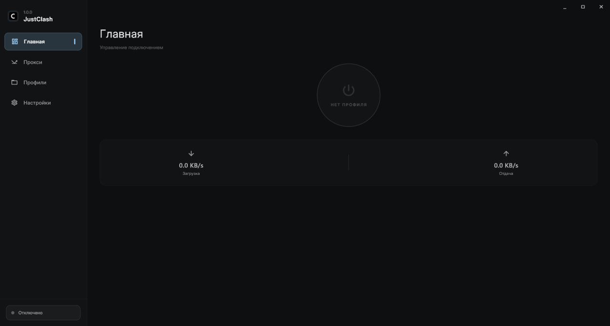
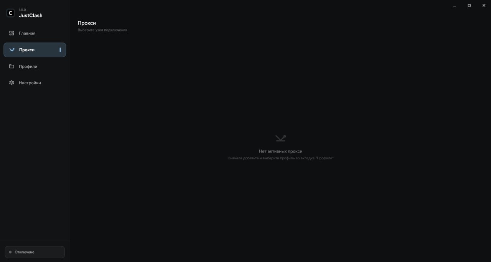
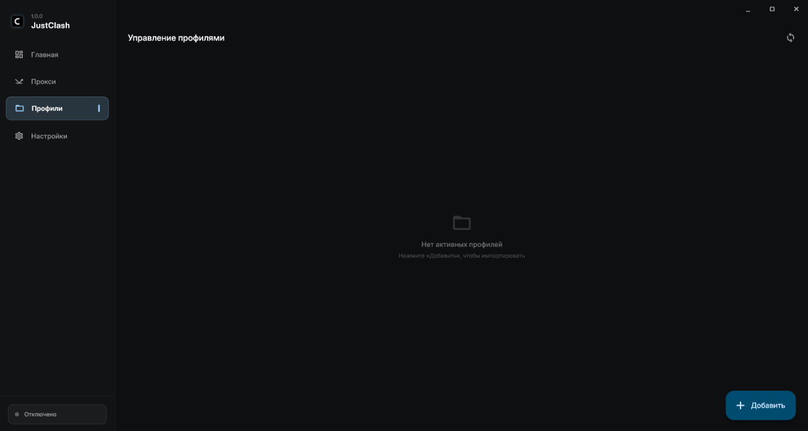
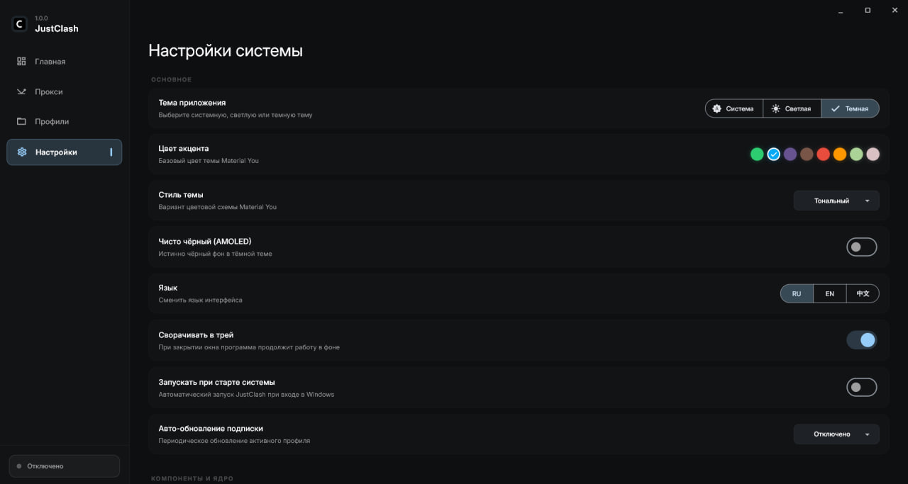

# JustClash

**Лёгкий VLESS / прокси-клиент для Windows, оптимизированный под слабые ПК.**

[English](README.md) · [Русский](README.ru.md) · [中文](README.zh.md)

# О проекте

JustClash — простой, быстрый и без рекламы прокси-клиент для Windows. Работает на ядре **Mihomo (Clash.Meta)**, которое встроено в приложение.

# Скриншоты

  
  
  
  

# Возможности

- **Системный TUN-режим** — защищает трафик всей системы
- **Импорт по ссылке-подписке в один клик** (VLESS и другие протоколы, Clash- и raw-конфиги)
- **Автообновление подписок** — при запуске и в фоне
- **Выбор серверов и локаций**, группы прокси, замер задержки, флаги стран
- **Режимы «Правила» и «Прямое подключение»**
- **Встроенные гео-базы** с автообновлением
- **Темы**: светлая / тёмная / AMOLED-чёрная + выбор акцентного цвета
- **Язык**: русский, английский, китайский
- **Системный трей**, автозапуск с Windows, запуск в одном экземпляре
- **Низкое потребление ресурсов** — комфортно даже на слабых ПК

# Установка

1. Скачай последний `JustClash-Setup-x.x.x.exe` со страницы [Releases](https://github.com/JustDevelo/JustClash/releases).
2. Запусти и пройди мастер установки.

# Технологии

- Интерфейс: Flutter (Dart)
- Ядро: [Mihomo (Clash.Meta)](https://github.com/MetaCubeX/mihomo)

# Лицензия

См. файл [LICENSE](LICENSE).
